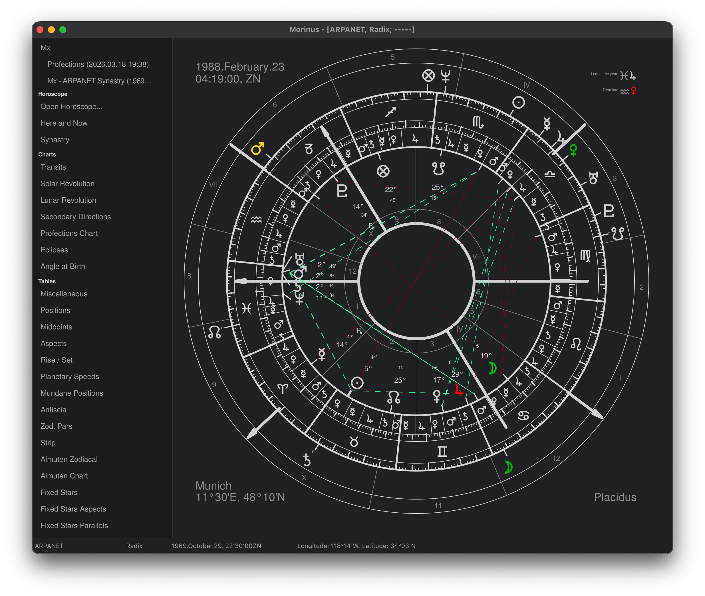

# Morinus 10.0.0 (Aries)



**Open Source Traditional Astrology Software — Modern, Fast, and Extensible**

---

## About Morinus

Morinus is a powerful, open source astrology program focused on traditional techniques, precision, and flexibility. Version 10.0.0 is a major new release, rebuilt from the ground up:

- **Python 3 migration** (from Python 2.7)
- **All-new GUI and UX** — modern, fluid, and keyboard-driven
- **Cross-platform**: macOS, Windows, Linux
- **Community-driven**: open to contributions, issues, and feature requests

---

## Features
- High-precision Swiss Ephemeris calculations
- Traditional techniques: Profections, Directions, Firdaria, Decennials, Zodiacal Releasing, and more
- Modern, responsive GUI with sidebar navigation and workspace
- Fast keyboard controls for all major actions
- Multi-language support
- Extensive chart types: natal, transit, solar/lunar revolutions, synastry, mundane, etc.
- Customizable appearance and color themes
- Fixed stars, Arabic parts, planetary hours, and more

---

## Screenshot


---

## Installation

### macOS
- Download the latest `.dmg` or `.app` from [Releases](https://github.com/primum-mobile/aries/releases)
- Or build from source:
	```bash
	git clone https://github.com/primum-mobile/aries.git
	cd aries
	python3 -m venv .venv && source .venv/bin/activate
	pip install -r requirements.txt
	python3 morinus.py
	```

### Windows
- Download the latest `.exe` installer from [Releases](https://github.com/primum-mobile/aries/releases)
- Or build from source (Python 3.8+ required)

### Linux
- Build from source as above (ensure wxPython and Swiss Ephemeris dependencies are installed)

---

## Quick Start
1. Launch Morinus
2. Open or create a horoscope
3. Explore charts, tables, and time lord techniques from the sidebar
4. Use keyboard shortcuts for fast navigation (see below)

---

## Keyboard Controls & UX
- Sidebar navigation: `Tab` / `Shift+Tab`
- Open chart: `Ctrl+O`
- Save chart: `Ctrl+S`
- Step through time: `←` `→` (left/right arrows)
- Switch chart type: `Ctrl+1`, `Ctrl+2`, ...
- All actions are accessible via keyboard for rapid workflow

---

## Contributing
We welcome contributions! Please see [CONTRIBUTING.md](CONTRIBUTING.md) for guidelines, or open an issue to discuss bugs or features.

---

## License
Morinus is released under the GNU General Public License v3.0 (GPL-3.0). See [LICENSE](LICENSE) for details.

---

## Credits & Links
- Original author: Roberto Luporini
- Major overhaul: Max (2026)
- [Project website](https://github.com/primum-mobile/aries)
- [Issue tracker](https://github.com/primum-mobile/aries/issues)

---

*Morinus 10.0.0 — Aries.*
